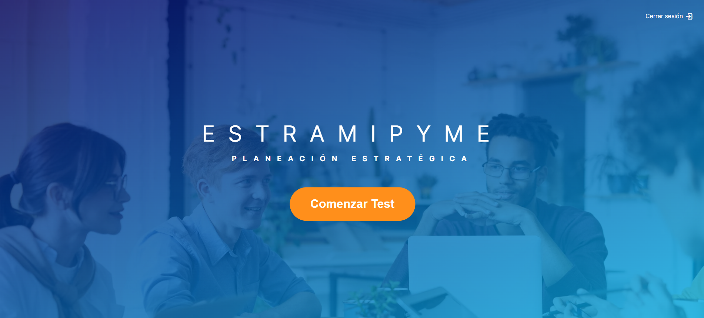
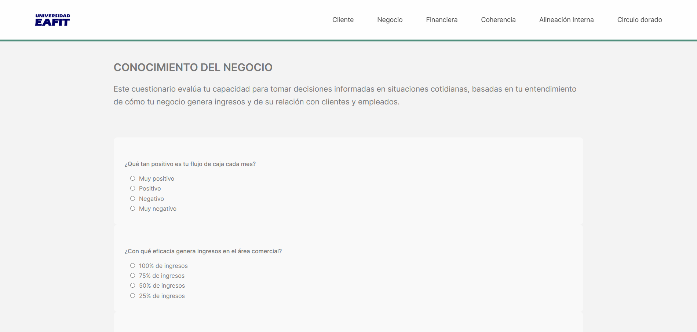
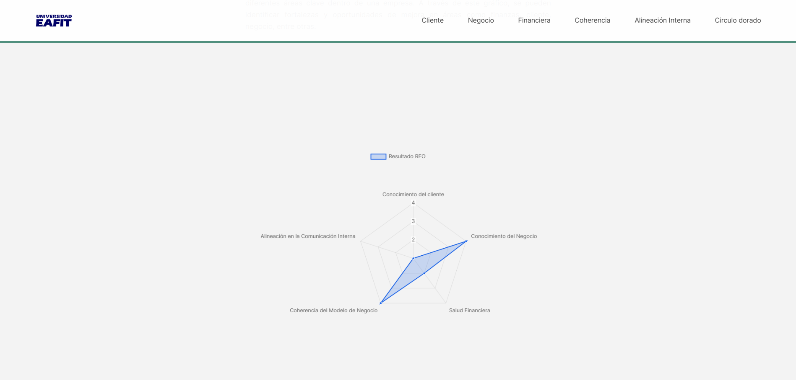
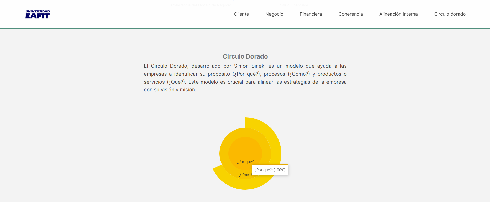

<h1 style="text-align: center;"><strong>Estramipyme</strong></h1>

<h2 style="text-align: center;">Planeación Estratégica</h2>

#### Estramipyme es una plataforma diseñada para ayudar a emprendedores de pequeñas, medianas y grandes empresas a conocer el estado de su negocio y proporcionar estrategias para mejorarlo. Utilizando herramientas como el Radar Estratégico Organizacional y el Círculo Dorado de Simon Sinek, Estramipyme ofrece un enfoque integral para evaluar y fortalecer las áreas clave de una organización.

  <a href="https://estramipime.web.app/"><strong>Visita Estramipyme aquí</strong></a>

## **¿Qué es Estramipyme?**

Estramipyme es una metodología desarrollada en 2019 para micronegocios, pequeñas y medianas empresas. Ofrece una forma ágil y accesible de formular estrategias competitivas, utilizando herramientas como el **`Círculo Dorado de Simon Sinek y el Radar Estratégico Organizacional`**. Diseñada para ayudar a entender el éxito del negocio y definir objetivos futuros, es ideal para quienes no pueden pagar consultoría tradicional.

La idea surgió de Angie Henríquez de la Dirección de Innovación EAFIT. La metodología fue desarrollada por Susana Álvarez Delgado y Santiago Zapata Correa, estudiantes del MBA de la Universidad EAFIT, bajo la supervisión de Luz María Rivas-Montoya. El libro **Estramipyme** (Editorial EAFIT) sirve como guía para aplicar esta metodología.

## **Estructura y Características del Proyecto**

La página de Estramipyme es una **monopágina**, diseñada así para facilitar la navegación y ofrecer una experiencia de usuario más fluida y directa.   Incluye las siguientes funcionalidades:

- **Landing Page:** La página de inicio presenta el nombre del proyecto, Estramipyme, y ofrece navegación a las secciones principales: Iniciar Sesión y Registrarse. Además, la página incluye el nombre Estramipyme y el eslogan "Planeación Estratégica".

  

- **Botón Comenzar Test:** Este botón se encuentra ubicado en la vista incial, se habilita cuando un usuario registrado inicia sesión correctamente, permitiéndole realizar los cuestionarios.

  

- **Registro e Inicio de Sesión:** Los usuarios pueden registrarse o iniciar sesión desde una página con un diseño intuitivo para garantizar un acceso sencillo.   En la sección _registrarse_, los usuarios deben especificar su tipo de persona (natural/jurídica), tipo de documento, el sector en el que se encuentra su empresa, entre otros datos básicos de registro.

 
  

 - **Restablecer contraseña:** Los usuarios pueden solicitar restablecer contraseña al darle    En la sección _¿Haz olvidado la contraseña?_, posteriormente de enviar restablecer contraseña, aparecerá un modal para colocar la nueva contraseña.

 
 
  

- **Cuestionarios Dinámicos:** Después de iniciar sesión y hacer clic en el botón _Comenzar Test_, los usuarios son dirigidos a la primera sección de cuestionarios en una sola página. Este diseño facilita la recopilación de datos y la evaluación de diferentes aspectos del negocio, alimentando el Radar Estratégico Organizacional y el Círculo Dorado de Sinek.

 

- **Botón de Limpiar Respuestas:** Permite restaurar los cuestionarios, dejando todas las respuestas en blanco nuevamente.

   

- **Navegación a Resultados:** Una vez que todas las preguntas han sido respondidas, debes darle al botón ver resultados para visualizar las gráficas.

  

- **Visualización de Resultados:** Los resultados de los cuestionarios se presentan en gráficos interactivos, como el Radar Estratégico Organizacional y el Círculo Dorado de Sinek, permitiendo una visualización clara y comprensible del estado del negocio.

  
   

  - **Reporte de resultados:** Si deseas descargar el reporte en PDF, debes darle al botón *Generar reporte en PDF*, se descargará un PDF con los resultados y algunas recomendaciones.

  

  

#### **Otras Funcionalidades**

- **Barra de Progreso:** En la parte superior, se muestra una barra de progreso que se va llenando a medida que se responden las preguntas.

  

- **Validación de Respuestas:** Al hacer clic en el botón de resultados, la plataforma verifica si hay preguntas sin responder. Si existen, te devuelve a la primera pregunta vacía para que la completes, señalando las preguntas sin respuesta con un recuadro y un texto `Este campo no puede estar vacío` de color rojo.

   

- **Footer:** La página finaliza con un footer que incluye una breve descripción de *Estramipyme*, junto con una sección de `Contáctenos` y enlaces a redes sociales.

   

  <a href="https://estramipime.web.app/"><strong>Visita Estramipyme aquí</strong></a>

  <a href="https://view.genially.com/66bd54d7c5ecc5bc824909c4/presentation-manual-de-usuario-estramipyme"><strong>Manual de Usuario Estramipyme</strong></a>

## **Valores de Estramipyme**

- Innovación - 
- Compromiso - 
- Calidad - 
- Integridad - 
- Trabajo en Equipo - 

## **Tecnologías Utilizadas**

En este proyecto se utilizaron las siguientes tecnologías y lenguajes:

-     **ECharts** - **Chart.js** - Librerías para la creación e integración de gráficos interactivos.
-    **Angular** - Framework utilizado para la migración y desarrollo del proyecto.
-    **TypeScript** - Superset de JavaScript utilizado para desarrollar en Angular.
-    **Netlify** - Plataforma utilizada para el despliegue de la página web.
-    **Github** - Utilizado para la gestión de versiones y colaboración en el proyecto.
-     **Microsoft Teams** - **Google Meet** - Utilizados para la comunicación (dailys y reuniones) y coordinación del equipo durante el desarrollo en un entorno remoto.

## **Referencias**

- **Libro Estramipyme de Luz María Rivas-Montoya** - Guía completa para la aplicación de la metodología Estramipyme.
- [Círculo Dorado de Simon Sinek](https://www.startwithwhy.com) - Referencia utilizada para la implementación del gráfico del Círculo Dorado en el proyecto.
- [Angular Documentation](https://angular.io/docs) - Recurso principal para la migración y desarrollo del proyecto en Angular.
- [ECharts Documentation](https://echarts.apache.org/en/index.html) - Referencia utilizada para la creación y personalización de gráficos en la página.
- [Chart.js Documentation](https://www.chartjs.org/docs/latest/) - Fuente de consulta para la integración de gráficos interactivos en el proyecto.
- **Manual de Marca Eafit** - Consultado para el uso de fuentes y colores en el diseño de la página.
