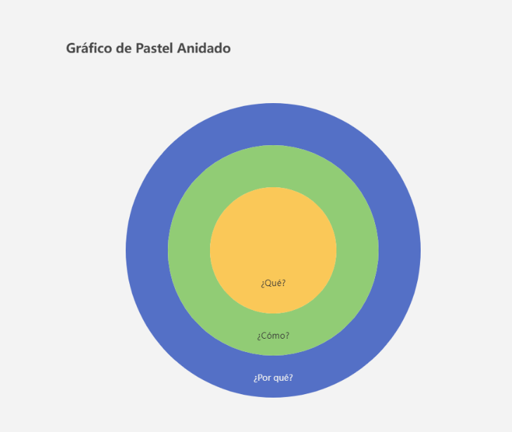

# Documentación Apache ECharts

## ¿Qué es Apache ECharts?

**Apache ECharts** es una librería de visualización de datos en `JavaScript` de código abierto que permite crear gráficos interactivos y personalizados de manera sencilla. Está diseñada para manejar grandes volúmenes de datos y proporcionar una experiencia de usuario fluida.

## Características Principales

- **Amplia Variedad de Tipos de Gráficos:** Soporta numerosos tipos de gráficos, cada uno con sus propias configuraciones y opciones
  - **Gráficos de Barras**: Ideal para comparar categorías.
  - **Gráficos de Líneas**: Útil para mostrar tendencias a lo largo del tiempo.
  - **Gráficos Circulares (Pie)**: Muestra proporciones o porcentajes.
  - **Gráficos de Dispersión**: Visualiza relaciones entre dos variables.
  - **Gráficos de Radar**: Presenta datos multidimensionales.
  - **Gráficos de Áreas**: Similar a los gráficos de líneas, pero con áreas rellenas.
  - **Gráficos de Mapas**: Muestra datos geoespaciales en mapas interactivos.
- **Interactividad Avanzada:** Ofrece múltiples formas de interacción
  - **Tooltips**: Muestra información adicional cuando el usuario pasa el cursor sobre un elemento.
  - **Eventos**: Maneja eventos como clics, desplazamientos y más para interacciones personalizadas.
  - **Zoom y Desplazamiento**: Permite hacer zoom y desplazarse en gráficos para explorar datos en detalle.
  - **Selección de Datos**: Ofrece herramientas para seleccionar y resaltar partes del gráfico.
- **Alta Personalización:** Puedes personalizar casi todos los aspectos de los gráficos
  - **Colores y Estilos**: Modifica colores, bordes, fuentes y estilos de los elementos del gráfico.
  - **Etiquetas**: Añade y personaliza etiquetas en los ejes, series y elementos.
  - **Títulos y Subtítulos**: Configura títulos y subtítulos para proporcionar contexto.
  - **Animaciones**: Controla la duración y tipo de animaciones para los gráficos.
- **Manejo de Grandes Volúmenes de Datos:** Está optimizado para manejar grandes volúmenes de datos de manera eficiente
  - **Renderizado Rápido**: Utiliza técnicas avanzadas para asegurar un renderizado rápido incluso con grandes conjuntos de datos.
  - **Paginación y Agrupación**: Soporta técnicas para paginar y agrupar datos, mejorando la gestión de grandes datasets.
- **Responsividad y Adaptabilidad:** Los gráficos son responsivos y se adaptan a diferentes tamaños de pantalla y dispositivos
  - **Diseño Adaptativo**: Los gráficos se ajustan automáticamente al tamaño del contenedor en el que se encuentran.
  - **Soporte para Móviles**: Optimizado para funcionar bien en dispositivos móviles y pantallas táctiles.
- **Integración y Extensibilidad: S**e puede integrar fácilmente con otras bibliotecas y herramientas
  - **Soporte para Frameworks**: Compatible con frameworks como React, Vue y Angular.
  - **Extensiones y Plugins**: Permite agregar funcionalidades adicionales a través de extensiones y plugins personalizados.
- **Soporte para Datos Dinámicos: P**ermite actualizar datos en tiempo real
  - **Actualización en Vivo**: Puedes actualizar los datos de los gráficos dinámicamente sin necesidad de recargar la página.
  - **Streaming de Datos**: Soporta la visualización de datos en streaming para aplicaciones en tiempo real.
- **Soporte Multilenguaje y Localización: A**dmite la configuración de múltiples lenguajes y localizaciones
  - **Internacionalización**: Permite configurar textos y etiquetas en diferentes idiomas.
  - **Formato de Datos Locales**: Soporta formatos de fecha, números y otras configuraciones locales.
- **Documentación y Comunidad Activa: C**uenta con una documentación completa y una comunidad activa
  - **Documentación Oficial**: Ofrece guías detalladas, ejemplos y referencias para facilitar el uso de la biblioteca.
  - **Comunidad y Soporte**: Cuenta con una comunidad activa que puede ayudar con problemas y ofrecer soporte.

## Instalación de Echarts

### Usando CDN

Para incluir ECharts mediante un CDN, se añade el siguiente script a tu HTML:

```html
<script src="[https://cdn.jsdelivr.net/npm/echarts/dist/echarts.min.js](https://cdn.jsdelivr.net/npm/echarts/dist/echarts.min.js)"></script>
```

### Usando npm

Si prefieres usar npm, primero instala la librería:

```bash
npm install echarts
```

Luego, impórtar al archivo JavaScript:

```jsx
import * as echarts from "echarts";
```

### Guía paso a paso

Crear un Contenedor para el Gráfico

Añadir un contenedor en tu HTML donde se mostrará el gráfico:

```html
<div id="main" style="width: 600px; height: 400px;"></div>
```

En el archivo JavaScript, inicializar el gráfico y configurar las opciones básicas:

```jsx
var myChart = echarts.init(document.getElementById("main"));

var option = {
  title: {
    text: "ECharts Demo",
  },
  tooltip: {},
  legend: {
    data: ["Sales"],
  },
  xAxis: {
    data: ["Shirts", "Cardigans", "Chiffons", "Pants", "Heels", "Socks"],
  },
  yAxis: {},
  series: [
    {
      name: "Sales",
      type: "bar",
      data: [5, 20, 36, 10, 10, 20],
    },
  ],
};

myChart.setOption(option);
```

## Configuración Básica

La configuración básica de ECharts se realiza a través de un objeto `option`. Aquí se pueden definir títulos, ejes, datasets y más.

### Títulos y Etiquetas

```jsx
title: {
text: 'Título del Gráfico'
},
tooltip: {
trigger: 'item' // Tipo de activación del tooltip
},
legend: {
data: ['Nombre de Serie']
}
```

### Ejes

Configura los ejes X e Y:

```jsx
xAxis: {
type: 'category', // Tipo de eje X
data: ['Categoría 1', 'Categoría 2', 'Categoría 3'] // Datos de las categorías
},
yAxis: {
type: 'value' // Tipo de eje Y
}
```

### Datasets

Define los datasets que se mostrarán en el gráfico:

```jsx
series: [
  {
    name: "Nombre de Serie",
    type: "bar", // Tipo de gráfico (bar, line, pie, etc.)
    data: [10, 20, 30], // Datos de la serie
  },
];
```

## Personalización Avanzada

ECharts ofrece muchas opciones de personalización para adaptar los gráficos a tus necesidades.

### Colores y Estilos

```jsx
series: [
  {
    type: "bar",
    data: [10, 20, 30],
    itemStyle: {
      color: "#58B0A8", // Color de las barras
    },
  },
];
```

### Animaciones

Controla la animación de los gráficos:

```jsx
animation: true,
animationDuration: 1000 // Duración de la animación en milisegundos
```

### Etiquetas

Añade etiquetas a los datos:

```jsx
series: [
  {
    type: "bar",
    data: [10, 20, 30],
    label: {
      show: true,
      position: "top", // Posición de las etiquetas
    },
  },
];
```

## Interactividad

ECharts permite agregar interactividad a los gráficos:

### Tooltips

Los tooltips muestran información adicional cuando el usuario pasa el cursor sobre un elemento del gráfico:

```jsx
tooltip: {
trigger: 'axis', // Activa el tooltip al pasar el cursor sobre el eje
formatter: '{b0}: {c0}' // Formato del tooltip
}
```

### Eventos

Puedes manejar eventos como clics en los elementos del gráfico:

```jsx
myChart.on('click', function (params) {
console.log([params.name](http://params.name/)); // Muestra el nombre del elemento clicado
});
```

## Tipos de Gráficos

ECharts soporta una variedad de tipos de gráficos. Aquí están algunos de los más comunes:

- **Line Chart** - Gráfico de líneas
  - Basic Line Chart
  - Smoothed Line Chart
- **Bar Chart** - Gráfico de barras
  - Basic Bar
  - Waterfall Chart
  - Stacked Bar Chart
- **Area Chart** - Gráfico de áreas
  - Basic Area Chart
  - Stacked Area Chart
  - Gradient Stacked Area Chart
- **Pie Chart** - Gráfico de pastel
  - Basic Pie Chart
  - Donut Chart
  - Rose Chart
- **Scatter Plot** - Diagrama de dispersión
  - Basic Scatter Plot
  - Bubble Chart
- **Radar Chart** - Gráfico radar
  - Basic Radar Chart
  - Radar Chart with Multiple Variables
- **Histogram** - Histograma
  - Basic Histogram
  - Stacked Histogram
- **Heatmap** - Mapa de calor
  - Basic Heatmap
  - Heatmap with Gradient Color
- **Box Plot** - Diagrama de caja
  - Basic Box Plot
  - Box Plot with Multiple Groups
- **Candlestick Chart** - Gráfico de velas
  - Basic Candlestick Chart
  - Candlestick Chart with Volume
- **Polar Chart** - Gráfico polar
  - Basic Polar Chart
  - Polar Bar Chart
  - Polar Line Chart
- **Tree Diagram** - Diagrama de árbol
  - Basic Tree Diagram
  - Sunburst Tree Diagram
- **Treemap** - Mapa de árbol
  - Basic Treemap
  - Treemap with Hierarchical Data
- **Map** - Mapa
  - Basic Map
  - Geo Map with Custom Data
- **Gantt Chart** - Gráfico de Gantt
  - Basic Gantt Chart
  - Gantt Chart with Dependencies
- **Sankey Diagram** - Diagrama de Sankey
  - Basic Sankey Diagram
  - Sankey Diagram with Custom Labels
- **Funnel Chart** - Gráfico de embudo
  - Basic Funnel Chart
  - Funnel Chart with Multiple Stages
- **Boxplot** - Diagrama de caja
  - Basic Boxplot
  - Boxplot with Outliers
- **Chord Diagram** - Diagrama de acordes
  - Basic Chord Diagram
  - Chord Diagram with Custom Links
- **Custom Chart** - Gráfico personalizado
  - Custom Graphic Component
  - Interactive Custom Chart

### Ejemplo

```html
<!DOCTYPE html>
<html lang="es">
  <head>
    <meta charset="UTF-8" />
    <meta name="viewport" content="width=device-width, initial-scale=1.0" />
    <title>Gráfico Radar Básico</title>
    <!-- Biblioteca de ECharts -->
    <script src="https://cdn.jsdelivr.net/npm/echarts@5.4.2/dist/echarts.min.js"></script>
    <style>
      /* Establecer el tamaño del contenedor del gráfico */
      #main {
        width: 600px;
        height: 400px;
        margin: 0 auto;
      }
    </style>
  </head>
  <body>
    <!-- Contenedor del gráfico -->
    <div id="radarChart"></div>
  </body>
</html>
```

Ejemplo gráfico Nested Pie (Pastel anidado)

```jsx
// Inicializar el gráfico
var myChart = echarts.init(document.getElementById("circleChart"));

// Configuración del gráfico
var option = {
  title: {
    text: "Gráfico de Pastel Anidado",
    top: "top",
  },
  tooltip: {
    trigger: "item",
  },
  series: [
    {
      name: "¿Por qué?",
      type: "pie",
      radius: ["50%", "70%"],
      center: ["50%", "50%"],
      label: {
        show: true,
        position: "inside",
        formatter: "¿Por qué?",
      },
      data: [{ value: 1, name: "¿Por qué?" }],
    },
    {
      name: "¿Cómo?",
      type: "pie",
      radius: ["30%", "50%"],
      label: {
        show: true,
        position: "inside",
        formatter: "¿Cómo?",
      },
      data: [{ value: 1, name: "¿Cómo?" }],
    },
    {
      name: "¿Qué?",
      type: "pie",
      radius: ["0%", "30%"],
      label: {
        show: true,
        position: "inside",
        formatter: "¿Qué?",
      },
      data: [{ value: 1, name: "¿Qué?" }],
    },
  ],
};

// Establecer la configuración para el gráfico
myChart.setOption(option);
```


